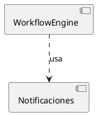

# Fase 4.0 · Preparación

> Setup de herramientas antes de generar los artefactos.

---

## 1. Enterprise Architect

### 1.1 Instalación
- Versión: Enterprise Architect 16+ (cualquier edición que soporte UML 2.5)
- El profesor probablemente facilita licencia académica si no se tiene

### 1.2 Crear el proyecto
1. Abrir EA → New Project → guardar como `tramites-arquitectura.eap` en `fase4/diagramas/`
2. En el árbol del proyecto crear estos paquetes:
   ```
   📁 Tramites Arquitectura
   ├── 📁 1. Diagrama de Actividad (UML 2.5)   ← el flujo del negocio
   ├── 📁 2. Diagrama de Componentes           ← arquitectura
   ├── 📁 3. Diagrama de Despliegue
   ├── 📁 4. Diagrama de Capas
   └── 📁 5. Diagramas de Secuencia
   ```

### 1.3 Configurar para UML 2.5
- Settings → Project Types → UML 2.5 (no UML 1.x)

---

## 2. PlantUML (alternativa rápida)

Si EA da problemas, **PlantUML** sirve para borradores y diagramas no obligatoriamente formales:

### 2.1 VS Code
- Instalar extensión `PlantUML` (jebbs.plantuml)
- Instalar Java JRE
- Instalar Graphviz (dot.exe)

### 2.2 Probar
Crear `prueba.puml`:

`Alt+D` → debería renderizar el diagrama.

> **Decisión:** los diagramas que el profe pidió en EA (actividad UML 2.5, componentes, despliegue) se hacen en EA. Los borradores rápidos y los de secuencia se pueden hacer en PlantUML y exportar PNG.

---

## 3. ArchUnit (Java)

### 3.1 Agregar dependencia a `pom.xml`

```xml
<dependency>
    <groupId>com.tngtech.archunit</groupId>
    <artifactId>archunit-junit5</artifactId>
    <version>1.3.0</version>
    <scope>test</scope>
</dependency>
```

### 3.2 Verificar que se descarga

```bash
cd "c:/Users/Isael Ortiz/Documents/1PSW1/Backend"
./mvnw dependency:resolve
```

Buscar `archunit-junit5` en la salida.

---

## 4. Estructura de carpetas para artefactos

```bash
cd "c:/Users/Isael Ortiz/Documents/1PSW1/Backend/guia_reorganizacion/fase4"
# Ya creadas: diagramas/ y adr/
```

Convención de nombres:
- Diagramas: `<tipo>_<descripcion>.png` y `.eap` cuando aplique
- ADRs: `ADR-NNN-titulo-corto.md` (NNN secuencial)

---

## 5. Branch para la documentación

Documentar también en una rama:
```bash
cd "c:/Users/Isael Ortiz/Documents/1PSW1/Backend"
git checkout -b docs/arquitectura-fase4
```

---

## 6. Confirmación

- [ ] EA instalado y proyecto creado
- [ ] PlantUML funcional como respaldo
- [ ] ArchUnit en pom.xml resuelve
- [ ] Carpetas `diagramas/` y `adr/` existen
- [ ] Rama `docs/arquitectura-fase4` creada

---

## Próximo paso

Continuar con **`01_diagrama_componentes.md`** — el diagrama más importante para la nota.
