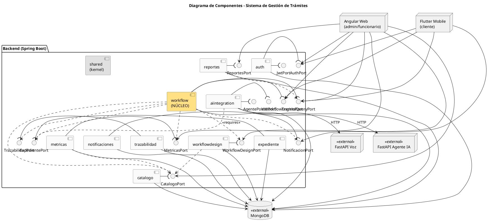

# Fase 4.1 · Diagrama de Componentes (UML 2.5)

> El diagrama **más importante** para la nota. Demuestra que el sistema está dividido en componentes con interfaces explícitas.

---

## 1. Objetivo

Producir un diagrama UML 2.5 de componentes que muestre:

1. Cada uno de los **9 componentes del backend** + **shared kernel**
2. La **interfaz que cada uno provee** (`<<provides>>` con notación de "lollipop")
3. Las **interfaces que cada uno requiere** (`<<requires>>` con notación de "socket")
4. El **shared kernel** consumido por todos
5. Los **clientes externos** (Angular Web, Flutter Mobile, microservicios IA FastAPI) y cómo consumen el sistema

---

## 2. Notación UML 2.5

### Componentes
- Rectángulo con icono de componente arriba a la derecha (símbolo de chip).
- Nombre dentro: `<<component>> nombre`.

### Interfaces (Ports)

```
            ────⊂           ────○
           Required         Provided
           (socket)         (lollipop)
```

Un componente:
- **Provee** una interfaz → "lollipop" (círculo) saliendo del componente.
- **Requiere** una interfaz → "socket" (semicírculo) saliendo del componente.
- Conectarse: el lollipop del proveedor encaja en el socket del consumidor.

### Estereotipos
- `<<component>>` para los componentes
- `<<interface>>` para las interfaces (Ports)
- `<<external>>` para sistemas externos (FastAPI, MongoDB)

---

## 3. Lista de componentes y sus puertos

| # | Componente | Provee | Requiere |
|---|------------|--------|----------|
| 1 | **shared** | (utilidades — no tiene Port formal) | — |
| 2 | **auth** | `AuthPort`, `JwtPort` | — |
| 3 | **catalogo** | `CatalogoPort` | — |
| 4 | **notificaciones** | `NotificacionPort` | — |
| 5 | **trazabilidad** | `TrazabilidadPort` | — |
| 6 | **metricas** | `MetricasPort` | `CatalogoPort` (lee actividades para SLA) |
| 7 | **expediente** | `ExpedientePort` | — |
| 8 | **workflowdesign** | `WorkflowDesignPort` | `CatalogoPort` (lee departamentos en prompt-flow) |
| 9 | **workflow** (núcleo) | `WorkflowEnginePort`, `TramiteQueryPort` | `WorkflowDesignPort`, `ExpedientePort`, `NotificacionPort`, `TrazabilidadPort`, `MetricasPort`, `CatalogoPort` |
| 10 | **aiintegration** | `VozPort`, `AgentePort` | `ExpedientePort` (transcripción rellena sección activa) |
| 11 | **reportes** | `ReportesPort` | `TramiteQueryPort` |

---

## 4. Bosquejo del diagrama (PlantUML como referencia)

Crear `fase4/diagramas/componentes.puml`:



Genera la imagen y guarda en `fase4/diagramas/componentes.png`.

---

## 5. Cómo construirlo en Enterprise Architect

### Paso A — Nuevo diagrama de componentes
1. Click derecho en el paquete "2. Diagrama de Componentes" → Add Diagram → Component
2. Nombrar: "Arquitectura de Componentes — Backend"

### Paso B — Crear los 11 componentes
Toolbox → Component → arrastrar al canvas.
Renombrar cada uno con su nombre del listado del punto 3.

### Paso C — Crear las interfaces
Por cada Port:
1. Toolbox → Interface → arrastrar al canvas
2. Nombrar (ej: `WorkflowEnginePort`)

### Paso D — Conectar provee/requiere
- **Provee:** click derecho en el componente → Realize → seleccionar la interfaz
- **Requiere:** click derecho en el componente → Use Dependency → seleccionar la interfaz

EA renderiza automáticamente el lollipop y socket.

### Paso E — Agregar nodos externos
- MongoDB como `<<database>>` (Toolbox → Database)
- FastAPI Voz, FastAPI Agente IA como `<<component>> <<external>>`
- Angular Web y Flutter Mobile como `<<actor>>` o `<<component>>` con estereotipo `<<client>>`

### Paso F — Layout
- Componentes "hoja" (sin requires): arriba/laterales (auth, catalogo, notificaciones, trazabilidad)
- Componente núcleo (workflow): centro
- Clientes externos: bordes

### Paso G — Exportar
1. File → Export Diagram → PNG
2. Guardar como `fase4/diagramas/componentes.png`
3. Resolución: alta (mínimo 1920px de ancho)

---

## 6. Verificación del diagrama

Checklist antes de marcar como terminado:

- [ ] Aparecen los 11 componentes
- [ ] Cada componente tiene al menos un lollipop (Port que provee)
- [ ] El componente `workflow` muestra los 6 sockets (requires)
- [ ] El shared kernel está visible y conectado al resto
- [ ] Los 3 clientes externos (Web, Mobile, IA externa) están en el diagrama
- [ ] MongoDB visible como base persistente
- [ ] Estereotipos `<<component>>`, `<<interface>>`, `<<external>>` aplicados
- [ ] El diagrama se ve "limpio" sin cruces de líneas innecesarios
- [ ] Está en formato UML 2.5 (no 1.x)

---

## 7. Cómo presentarlo al profe

El diagrama de componentes es **lo primero** que mostrarás en la presentación. Frase de apertura sugerida:

> *"El sistema está dividido en 9 componentes de negocio más un shared kernel. Cada componente expone su funcionalidad como una interfaz Port, y los demás solo lo consumen por esa interfaz. Esto significa que cualquier componente se puede sustituir sin afectar a los demás. El componente núcleo es workflow, que consume todos los otros vía sus respectivos Ports."*

---

## 8. Commit

```bash
git add fase4/diagramas/componentes.png fase4/diagramas/componentes.puml
git add fase4/diagramas/componentes.eap
git commit -m "docs(arquitectura): diagrama de componentes UML 2.5"
```

---

## Próximo paso

Continuar con **`02_diagrama_despliegue.md`**.
