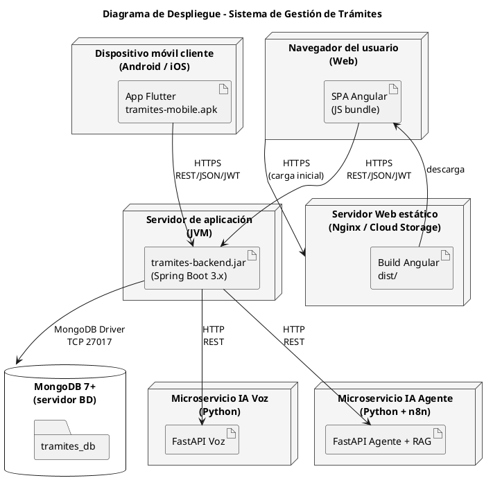

# Fase 4.2 · Diagrama de Despliegue (UML 2.5)

> Muestra **dónde corre cada cosa físicamente** y cómo se conectan los nodos.

---

## 1. Objetivo

Producir un diagrama de despliegue UML 2.5 que muestre:
- Los nodos físicos (servidores, dispositivos cliente)
- Los artefactos desplegados en cada nodo (jar, app, base de datos)
- Los protocolos de comunicación (HTTP, MongoDB driver)

---

## 2. Nodos a representar

| Nodo | Tipo | Artefacto desplegado |
|------|------|----------------------|
| Servidor de aplicación | Nodo (servidor) | `tramites-backend.jar` (Spring Boot) |
| Servidor MongoDB | Nodo (DB) | MongoDB 7+ |
| Servidor IA Voz | Nodo (microservicio) | FastAPI Voz |
| Servidor IA Agente | Nodo (microservicio) | FastAPI Agente (n8n + RAG) |
| Servidor Web (estático) | Nodo (web server) | Build de Angular `dist/` |
| Dispositivo móvil | Nodo (cliente) | App Flutter (`.apk` / `.ipa`) |
| Navegador del usuario | Nodo (cliente) | Chrome / Edge / Firefox |

---

## 3. Comunicaciones

| Origen | Destino | Protocolo |
|--------|---------|-----------|
| Browser → Web Server | Static files | HTTPS |
| Browser (SPA Angular) → Backend | REST | HTTPS / JSON / JWT |
| App Flutter → Backend | REST | HTTPS / JSON / JWT |
| Backend → MongoDB | Driver MongoDB | TCP 27017 |
| Backend → FastAPI Voz | REST | HTTP / JSON |
| Backend → FastAPI Agente | REST | HTTP / JSON |

---

## 4. Bosquejo (PlantUML)

`fase4/diagramas/despliegue.puml`:



---

## 5. Cómo construirlo en EA

### Paso A — Nuevo diagrama
- Paquete "3. Diagrama de Despliegue" → Add Diagram → Deployment

### Paso B — Crear nodos
Por cada nodo del punto 2: Toolbox → Node → arrastrar.

### Paso C — Agregar artefactos dentro de los nodos
- Click derecho dentro del nodo → New Element → Artifact

### Paso D — Conectar
Toolbox → Communication Path → arrastrar entre nodos.
Anotar protocolo en la flecha (HTTPS, MongoDB Driver, etc.).

### Paso E — Estereotipos útiles
- `<<device>>` para nodos cliente (móvil, browser)
- `<<server>>` para servidores
- `<<database>>` para BD
- `<<microservice>>` para los FastAPI

### Paso F — Exportar
Guardar como `fase4/diagramas/despliegue.png`.

---

## 6. Variantes a considerar

### Si quieres mostrar containerización
Agregar un nodo `<<container>>` con varios artefactos:

```
node "Docker Host" {
  node "<<container>> backend" { ... }
  node "<<container>> mongodb" { ... }
  node "<<container>> fastapi-voz" { ... }
}
```

### Si el deployment es cloud (AWS, GCP, etc.)
Mostrar las regiones/zonas:

```
cloud "AWS us-east-1" {
  node "EC2 backend"
  database "DocumentDB"
}
```

> **Recomendación:** mantener el diagrama **simple**. Si todavía no hay decisión clara de hosting, mostrar el modelo lógico (servidores genéricos) y mencionar oralmente "puede correr en Docker o cloud".

---

## 7. Verificación

- [ ] Aparecen los 7 nodos (cliente móvil, browser, web server, backend, mongo, IA voz, IA agente)
- [ ] Cada nodo tiene al menos un artefacto adentro
- [ ] Las flechas tienen el protocolo anotado (HTTPS, REST, etc.)
- [ ] Estereotipos aplicados (`<<server>>`, `<<device>>`, `<<database>>`)
- [ ] Se entiende el flujo: cliente → backend → BD/IA

---

## 8. Cómo presentarlo

> *"El sistema se despliega en 5 nodos físicos: el backend Spring Boot, MongoDB, dos microservicios de IA y el web server estático del Angular. Los clientes son la app Flutter y el navegador. Toda comunicación cliente→backend va por HTTPS con JWT. El backend usa el driver de MongoDB para persistencia y consume los microservicios IA por REST."*

---

## 9. Commit

```bash
git add fase4/diagramas/despliegue.png fase4/diagramas/despliegue.puml fase4/diagramas/despliegue.eap
git commit -m "docs(arquitectura): diagrama de despliegue UML 2.5"
```

---

## Próximo paso

Continuar con **`03_diagrama_capas.md`**.
