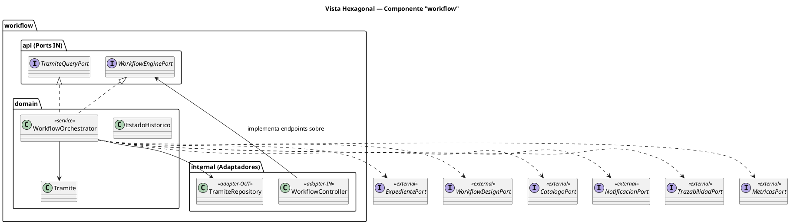

# Fase 4.3 · Diagrama de Capas / Arquitectura Hexagonal

> Vista alternativa al diagrama de componentes: muestra cómo se organiza **cada componente internamente** (api / domain / internal) y cómo el sistema completo se ve en capas.

---

## 1. Por qué este diagrama

El diagrama de componentes (4.1) muestra **qué componentes** existen y cómo se conectan.
El diagrama de capas muestra **la estructura interna** de cada componente y la **arquitectura general por capas**.

Juntos son complementarios:
- Componentes → vista horizontal (entre módulos)
- Capas → vista vertical (dentro de un módulo y del sistema)

---

## 2. Vista interna de un componente (hexagonal / ports & adapters)

```
                       ┌────────────────────┐
                       │   COMPONENTE       │
                       │                    │
        ┌──────────►   │   ┌────────────┐  │
        │              │   │            │  │ ◄────── Adaptador entrante
   Port │              │   │  DOMAIN    │  │         (Controller REST)
   IN   │              │   │  (lógica)  │  │
        │              │   │            │  │
        └──────────►   │   └────────────┘  │
                       │                    │
        ◄──────────    │                    │
        Port           │                    │
        OUT            │                    │ ◄────── Adaptador saliente
                       │                    │         (Repository, RestClient)
                       └────────────────────┘
```

- **Port IN** = interfaz que el componente provee (consumida desde afuera)
- **Port OUT** = interfaz que el componente requiere (provista por otros)
- **Domain** = lógica de negocio, aislada de tecnología
- **Adaptadores** = traducen entre el mundo exterior (HTTP, DB, otra API) y el dominio

---

## 3. Arquitectura por capas del sistema completo

```
┌──────────────────────────────────────────────────────────┐
│                  CAPA DE PRESENTACIÓN                    │
│                                                          │
│   ┌──────────────────┐   ┌──────────────────┐           │
│   │ Angular Web      │   │ Flutter Mobile   │           │
│   │ (admin/funcion.) │   │ (cliente)        │           │
│   └──────────────────┘   └──────────────────┘           │
└──────────────────────────────────────────────────────────┘
                          │ HTTPS / JSON / JWT
┌─────────────────────────┴────────────────────────────────┐
│              CAPA DE INTERFAZ (Backend API)              │
│                                                          │
│   Controllers REST (en internal/ de cada componente)     │
│   ─ exponen los Ports vía HTTP                           │
│   ─ validan, mapean, delegan                             │
└──────────────────────────────────────────────────────────┘
                          │ Llamadas a Ports (interfaces)
┌─────────────────────────┴────────────────────────────────┐
│             CAPA DE APLICACIÓN / SERVICIOS               │
│                                                          │
│   Componentes con Ports y Adaptadores:                   │
│                                                          │
│   ┌──────────┐ ┌──────────┐ ┌──────────┐ ┌──────────┐   │
│   │workflow  │ │expediente│ │workflow- │ │catalogo  │   │
│   │(núcleo)  │ │          │ │design    │ │          │   │
│   └──────────┘ └──────────┘ └──────────┘ └──────────┘   │
│                                                          │
│   ┌──────────┐ ┌──────────┐ ┌──────────┐ ┌──────────┐   │
│   │notif.    │ │trazabil. │ │metricas  │ │auth      │   │
│   └──────────┘ └──────────┘ └──────────┘ └──────────┘   │
│                                                          │
│   ┌──────────┐ ┌──────────┐                              │
│   │aiintegr. │ │reportes  │                              │
│   └──────────┘ └──────────┘                              │
│                                                          │
│   shared kernel (transversal)                            │
└──────────────────────────────────────────────────────────┘
                          │ Repos / RestClient
┌─────────────────────────┴────────────────────────────────┐
│             CAPA DE INFRAESTRUCTURA                      │
│                                                          │
│   ┌──────────────┐  ┌──────────────┐  ┌──────────────┐  │
│   │  MongoDB     │  │  FastAPI Voz │  │  FastAPI     │  │
│   │  (15+ cols)  │  │              │  │  Agente IA   │  │
│   └──────────────┘  └──────────────┘  └──────────────┘  │
└──────────────────────────────────────────────────────────┘
```

---

## 4. Bosquejo PlantUML para vista hexagonal de un componente

`fase4/diagramas/hexagonal_workflow.puml`:



---

## 5. Pasos

### Paso A — Diagrama de capas general
Hacer en EA o draw.io. Es estilo "torta" con 4 capas (presentación, interfaz, aplicación, infraestructura).

### Paso B — Diagrama hexagonal del workflow
Usar el PlantUML del punto 4. El componente `workflow` es el ejemplo más rico (consume 6 Ports).

### Paso C — Exportar
- `fase4/diagramas/capas.png`
- `fase4/diagramas/hexagonal_workflow.png`

---

## 6. Cómo presentarlo

> *"Internamente, cada componente sigue arquitectura hexagonal: el dominio en el centro, los Ports IN como puertas de entrada (los Controllers REST adaptan HTTP a llamadas al Port), y los Ports OUT como puertas de salida (a otros componentes o a infraestructura). Esto significa que el dominio nunca depende de Spring ni de Mongo — solo de interfaces."*

---

## 7. Commit

```bash
git add fase4/diagramas/capas.png fase4/diagramas/hexagonal_workflow.png fase4/diagramas/hexagonal_workflow.puml
git commit -m "docs(arquitectura): diagramas de capas y hexagonal"
```

---

## Próximo paso

Continuar con **`04_diagramas_secuencia.md`**.
