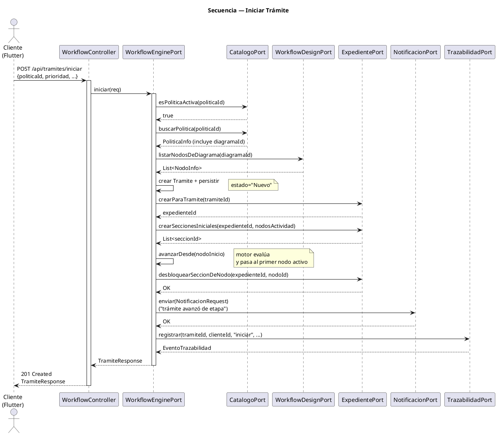
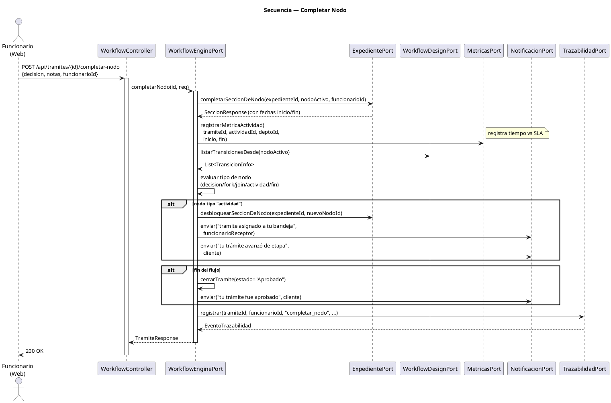
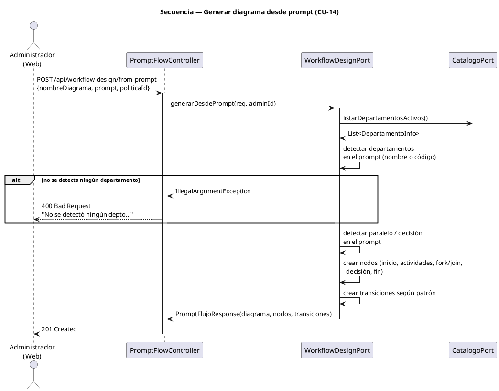

# Fase 4.4 · Diagramas de Secuencia

> Mostrar **cómo colaboran los componentes** durante los flujos clave. Es la prueba viva de que los Ports realmente se usan en runtime.

---

## 1. Objetivo

Producir 2-3 diagramas de secuencia UML 2.5 para los flujos más representativos:

1. **Iniciar trámite** — el más complejo, toca casi todos los componentes
2. **Completar nodo** — el flujo runtime más frecuente
3. **(opcional)** Generar diagrama por prompt — muestra integración con IA

---

## 2. Secuencia 1: Iniciar trámite

### Actores y componentes que participan
- Cliente (Flutter)
- WorkflowController (REST)
- WorkflowEnginePort
- CatalogoPort
- WorkflowDesignPort
- ExpedientePort
- NotificacionPort
- TrazabilidadPort

### Bosquejo PlantUML

`fase4/diagramas/secuencia_iniciar_tramite.puml`:



---

## 3. Secuencia 2: Completar nodo



---

## 4. Secuencia 3: Generar diagrama por prompt (opcional)



---

## 5. Pasos

### Paso A — Generar las imágenes
Renderizar cada `.puml` con la extensión PlantUML de VS Code (`Alt+D`) y exportar PNG.

### Paso B — Crear los mismos diagramas en EA (si el profe lo exige)
Paquete "5. Diagramas de Secuencia" → New Diagram → Sequence.

### Paso C — Guardar
- `fase4/diagramas/secuencia_iniciar_tramite.png`
- `fase4/diagramas/secuencia_completar_nodo.png`
- `fase4/diagramas/secuencia_prompt.png` (opcional)

---

## 6. Verificación

- [ ] Cada secuencia muestra al menos 4 componentes colaborando
- [ ] Las llamadas son a **Ports** (interfaces), no a clases concretas
- [ ] Los `alt` blocks reflejan ramas reales del código (decisión, paralelo, fin)
- [ ] Los nombres de método coinciden con los del código real

---

## 7. Cómo presentarlo

> *"Aquí muestro cómo se ven los Ports en runtime. Cuando un cliente inicia un trámite, el WorkflowEnginePort orquesta a 5 componentes diferentes — todos vía sus interfaces. Si mañana cambio cómo se envían las notificaciones (de web a push), nada de esto cambia, solo el adaptador que implementa NotificacionPort."*

---

## 8. Commit

```bash
git add fase4/diagramas/secuencia_*.png fase4/diagramas/secuencia_*.puml
git commit -m "docs(arquitectura): diagramas de secuencia de flujos clave"
```

---

## Próximo paso

Continuar con **`05_archunit_tests.md`** — el diferenciador técnico de la entrega.
